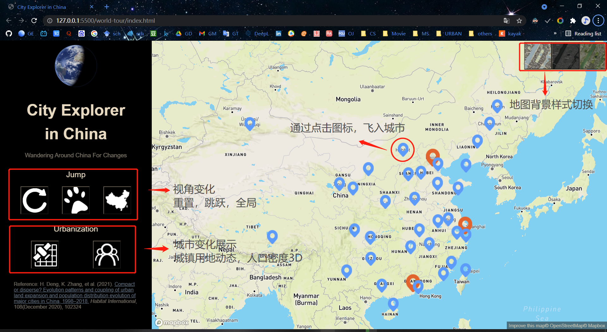
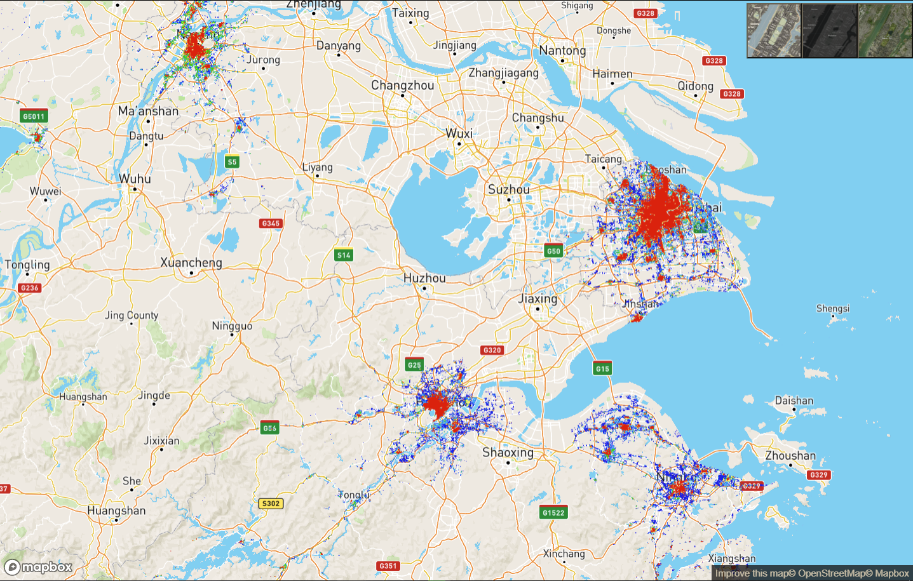
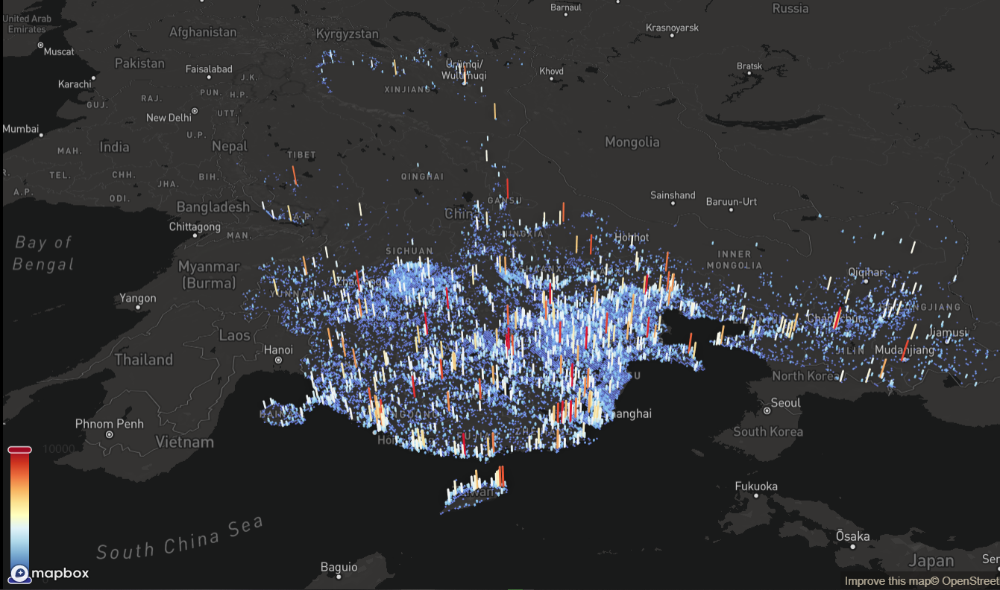

# Urban China 网页设计

作者：张可尔，1600013364，城市与环境学院，城乡规划系

## 开始

1. 目的：展示了1995-2015年各中国主要城市的城市用地动态变化与2015年的全中国的人口密度3D柱状图。本项目附有各地图模式的选择功能（普通模式，黑底模式，遥感模式），城市个案与中国总体的视角变化。

2. 应用框架：

   ​	`Mapbox-gl`：负责主要的地图展示

   ​	`Echarts-gl`：与`Mapbox`共同构建人口密度3D图

3. 地理数据通过`QGIS 3.18`进行前期处理。

## 土地数据

1. 数据来源：<a href="https://land.copernicus.eu/global/products/lc">Copernicus 全球城市覆盖数据集</a>

2. 通过`.gif`展示连续的中国城市用地变化，栅格数据采用Web Mercator投影（EPSG:3857）

   

## 人口数据

1. 数据来源：<a href="https://landscan.ornl.gov/">LandScan 全球人口数据</a>，将数据导出为json格式（[经度，纬度，人口]）

2. 以`Echarts-gl`为主要框架，`Mapbox-gl`为底图，进行人口密度3D图绘制

   